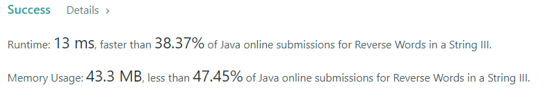

# Reverse Words in a String III

Given a string s, reverse the order of characters in each word within a sentence while still preserving 
whitespace and initial word order.

### Example 1:

Input: s = "Let's take LeetCode contest"
Output: "s'teL ekat edoCteeL tsetnoc"

### Example 2:

Input: s = "God Ding"
Output: "doG gniD"

### Result: 

The time complexity of this algorithm is O(N^2). And the same algorithm for memory.

